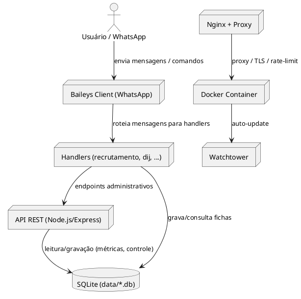
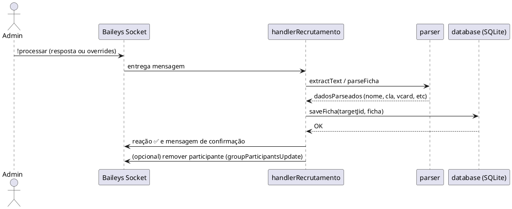
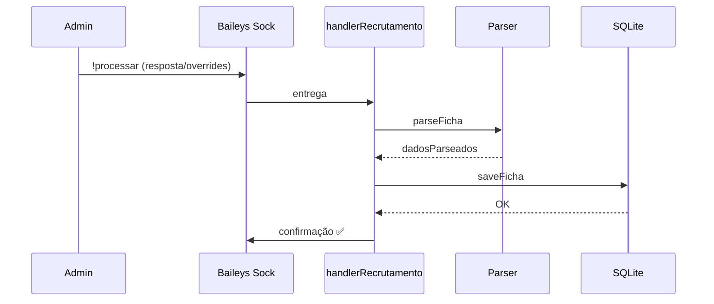

# 🐝 Abelhinha-v2

**Descrição:**  
Abelhinha-v2 é um bot modular de RPG/gestão de recrutas que combina automação de processos, minigames, controle de fichas e pontuações, com uma infraestrutura robusta de produção. Ideal para grupos de WhatsApp que querem uma experiência gamificada completa, mantendo segurança, logs e deploy automatizado.

---

## 🏗️ Visão Geral / Arquitetura

O Abelhinha-v2 foi projetado para rodar em produção de forma segura e escalável, com componentes claramente separados.

### Diagrama (PlantUML)


---

## 🎯 Funcionalidades Principais

- Processamento de fichas (manual e automático)
- Estatísticas por clã e por recrutador
- Exportação de contatos (.vcf) por clã com filtro por período
- API administrativa mínima (Express + Swagger)
- Armazenamento em SQLite (scripts de init/seed)
- Deploy via Docker

---

## 📝 Processamento de Fichas

- Comando: `!processar <número> [overrides]`
- Pode ser usado em modo resposta (responder à mensagem contendo a ficha) ou com overrides em linhas abaixo do comando.

Exemplos:
```
!processar 554499887766 nome="Itachi Uchiha"
!processar 554499887766 cla=Uchiha
```

Overrides suportados:
- nome
- cla
- recrutadopor (alias: recrutador)

Após processar:
- ficha salva em SQLite
- geração de vCard (fallback caso vCard não exista)
- reação ✅ e mensagem de confirmação
- opcional: remoção do usuário do grupo (se configurado/permissões)

---

## 🔁 Fluxo do comando !processar (Sequence — PlantUML)


---

## 🗄️ Modelo de Dados (Tabela fichas — PlantUML Classe / DB)
```plantuml
@startuml
class fichas {
  id : INTEGER PK
  jid : TEXT UNIQUE
  nome : TEXT
  cla : TEXT
  emojiCla : TEXT
  recrutadoPorTexto : TEXT
  registradoPorJid : TEXT
  data : TEXT        'DD/MM/YYYY (apenas leitura)
  timestamp : INTEGER 'epoch ms
  vcard : TEXT
}
database "SQLite" as DB
DB --> fichas
@enduml
```

---

## 🧭 Diagramas Mermaid (visualização rápida)
Componente:
```mermaid
graph LR
  User[Usuário / WhatsApp] --> Bot[Baileys Client]
  Bot --> Handlers[Handlers (recrutamento,dij,...)]
  Handlers --> DB[SQLite (data/*.db)]
  Handlers --> API[API REST (Express)]
  Proxy[Nginx Proxy] --> App[Container: abelinha-v2]
  Watchtower --> App
```

Sequência:


## 🎲 Minigames e Missões

> Em desenvolvimento — futuros módulos de joguinhos, missões e recompensas automáticas serão documentados aqui.

## 🔰 Vendas

> Em desenvolvimento — futuros módulos para integração de vendas de lojas do RPG de forma automática pelo bot serão adicionadas e documentadas aqui.

---

## 🐣 Setup Rápido

Pré-requisitos:
- Node.js >= 18 (recomendado 20)
- npm ou yarn
- Docker & docker-compose (opcional)
- Git

Instalação:
```bash
git clone <repo-url> abelinha-v2
cd abelinha-v2
npm install
```

Iniciar local:
```bash
npm run dev
# ou
node index.js
```

Docker:
```bash
docker-compose build --no-cache
docker-compose up
```

Scripts DB:
```bash
node scripts/init-db.js
node scripts/seed-db.js
```

---

## 🛠️ Dicas de Debug / Render PlantUML

- Para gerar imagens PlantUML localmente:
  - Instale PlantUML / Graphviz ou use services online (PlantUML server).
  - Ex.: https://www.plantuml.com/plantuml/svg/<encoded>

- Mermaid é renderizável no GitHub/GitLab diretamente.

- Erros comuns no container (Linux):
  - MODULE_NOT_FOUND devido a capitalização (ex.: Configs vs configs). Padronize imports para lowercase (`src/handlers`, `src/configs`, `utils`).

- Localizar logs:
```powershell
# PowerShell
Get-ChildItem -Recurse -Include *.js,*.ts | Select-String -Pattern "console\.log|console\.warn|console\.error"
```

Mensagem de debug importante:
- "[checkAdmin] ALERTA: Não foi possível encontrar informações do participante" — indica que groupMetadata.participants não contém o participante; verifique permissões do bot no grupo.

---

## 📦 Comandos do Bot (Principais)

- !processar <número> [overrides] — processa ficha (responder ou overrides)
- !andamento clas — estatísticas por clã
- !andamento players — estatísticas por recrutador
- !exportar [DD/MM/YYYY-DD/MM/YYYY] — exporta VCFs por clã
- !menu / !ajuda — mostra ajuda (admins)

---